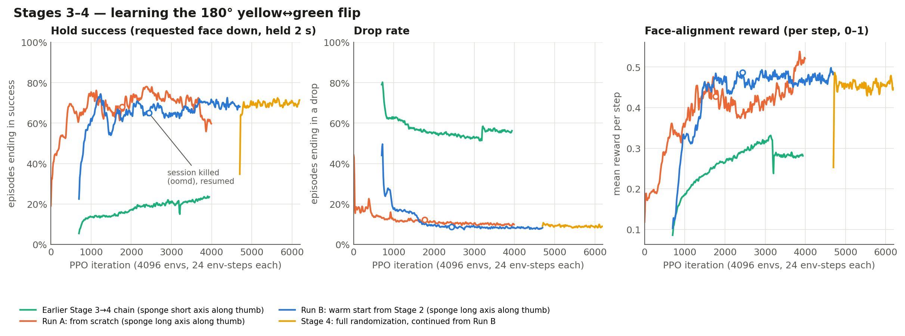
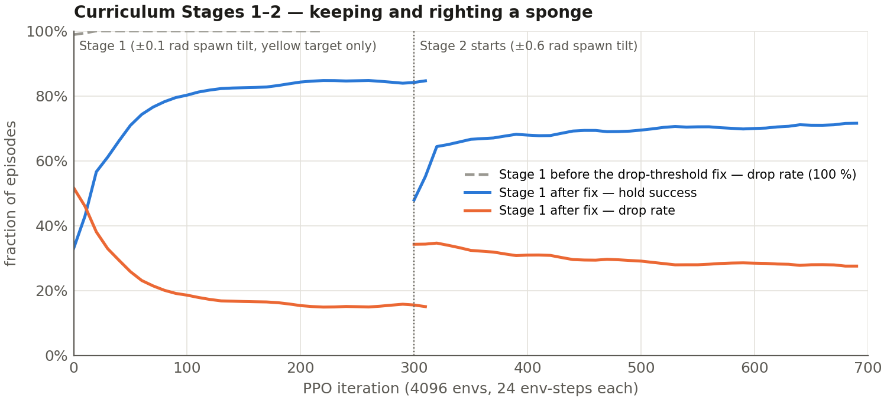
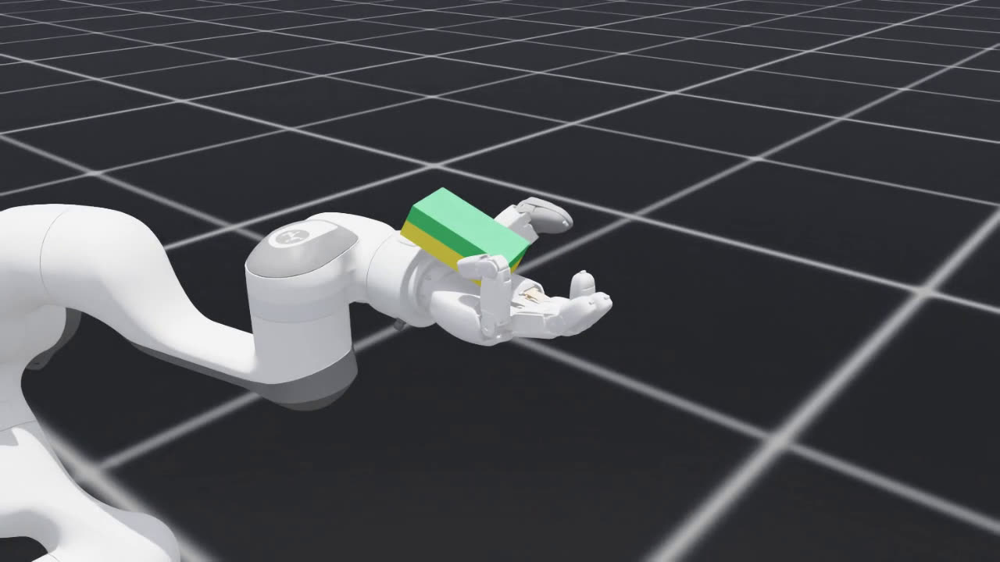
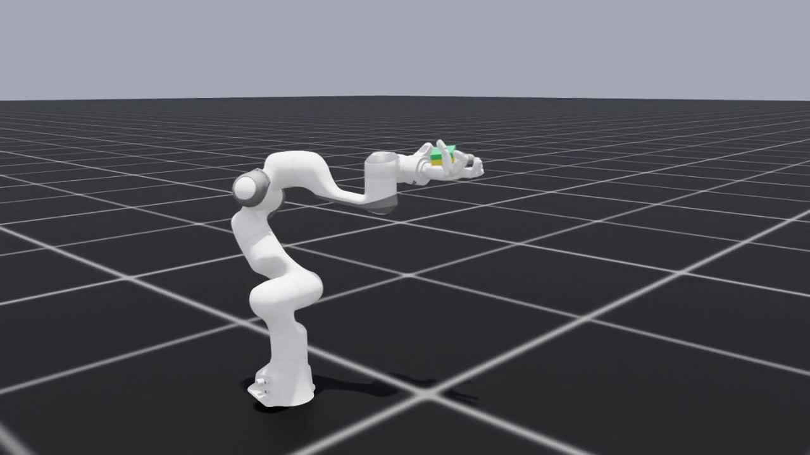

# In-Hand Reorientation with the XHand1

**Reinforcement learning for in-hand object reorientation on a 12-DoF RobotEra XHand1: from a vendor humanoid URDF to a policy that flips a kitchen sponge 180° in an upturned palm, at 70 % hold success under full domain randomization — and replays unchanged on a Franka-mounted hand.**

<p align="center">
  <a href="https://youtu.be/teRxEV7sdbk">
    
  </a>
</p>

<p align="center">
  <b><a href="https://youtu.be/teRxEV7sdbk">▶ Main demo — 2:19</a></b>
  &nbsp;·&nbsp;
  <a href="https://youtu.be/-kGYakc2aPo">Full policy comparison — 5:05</a>
  &nbsp;·&nbsp;
  <a href="docs/demos.md">Demo index</a>
</p>

| | |
|---|---|
| **Platform** | RobotEra XHand1 left (2L32), 12 actuated DoF · Franka Panda for the arm-mounted variant |
| **Simulation** | Isaac Sim 5.1 / Isaac Lab 0.54, PhysX 120 Hz, control 30 Hz, 4096 parallel envs |
| **Learning** | PPO (`rsl_rl`), MLP 512·256·128 ELU, 56-D obs → 12-D relative joint targets |
| **Compute** | 1 × RTX 4090, ~126k env-steps/s, ~1 s per iteration |
| **Result** | **70 %** hold success · **9 %** drop rate on the full flip task under full randomization |

---

## The task

A kitchen sponge (10 × 6.5 × 3.2 cm, 30 g) with a green scrub face and a yellow foam face sits in an
upturned palm. Each episode names one face. The hand must turn the sponge until the named face points
down and hold it there, grasped, for two continuous seconds.

When the named face starts up, that is a full **180° flip about the sponge's long axis**. When it
starts down, the job is to not let go.

Success is strict: the requested face within 20° of straight down, at least one contact sensor
touching the sponge, for 60 consecutive control steps. Letting the sponge get more than 25 cm from
the palm ends the episode as a drop.

There is no official hand-only asset for the XHand1, so the hand was extracted from RobotEra's STAR1
humanoid description and converted to USD (12 revolute joints, 13 bodies). The trained checkpoint is
replayed without modification on a second asset where the same hand is bolted to a Franka Panda — the
arm-mounted environment exposes the same 12 joints and the same observation layout.

## Results

Means over each run's last 100 iterations. Full per-iteration logs are in
[`data/training_logs/`](data/training_logs).

| Run | Sponge pose | Init | Iterations | Hold success | Drop rate | Face-align reward | Mean episode | Status |
|---|---|---|---|---|---|---|---|---|
| **Stage 4** (full randomization) | long axis along thumb | Run B `model_4699` | 4699–6198 | **70 %** | **9 %** | 0.46 | 179 | done |
| **Run B** (warm start) | long axis along thumb | Stage 2 `model_699` | 699–4699 | 68 % | 8 % | 0.49 | 189 | done |
| **Run A** (from scratch) | long axis along thumb | random | 0–3999 | 61 % | 10 % | 0.52 | 201 | done |
| Earlier Stage 3→4 chain | short axis along thumb | Stage 2 `model_699` | 699–3943 | 23 % | 56 % | 0.28 | 89 | superseded |
| Stage 2 | short axis along thumb | Stage 1 `model_300` | 300–699 | 71 % | 28 % | 0.23 | 60 | done |
| Stage 1 | short axis along thumb | random | 0–316 | 84 % | 15 % | 0.24 | 62 | done |

Mean episode length is in control steps at 30 Hz, capped at 360. Episodes end early on success or
drop, so a longer mean episode means the hand is holding on rather than dropping.

Both long-axis runs were killed once by `systemd-oomd` — Run A at iteration 1766, Run B at 2439 — and
resumed from their last checkpoints; the numbers above are from the resumed runs.

**Best checkpoint for demos and deployment: Stage 4 `model_6198`** — equal success to Run B, and
robust to the widest randomization ranges.



_Hold success is the real success criterion, drop rate the dominant failure mode, and face alignment
the dense shaping reward the policy has to raise from 0 to 1 to complete a flip. Curves are smoothed
with a 25-iteration moving average; hollow markers are where both runs were killed by the machine's
memory watchdog and resumed from their last checkpoint._

More: [docs/results.md](docs/results.md) · interactive version with hover values:
[docs/report/xhand_training_report.html](docs/report/xhand_training_report.html)

## What actually moved the needle

Almost all of the progress came from **fixing the environment, not tuning PPO**. Each item below is a
defect found by probing the simulation directly, the fix, and its measured effect.

| # | Area | Defect | Effect of the fix |
|---|---|---|---|
| 1 | Environment | Asset's identity rotation hung the hand fingers-down, so the "grasp" was a hook | Palm-up quaternion; sponge rests in the palm, 1 cm settle over 2 s, palm contact 0.285 N = its weight |
| 2 | Termination | "Dropped" meant > 15 cm from the hand base, but a resting sponge already sat 10 cm away | Raised to 25 cm. Stage 1 went from **100 % drops / 2.6-step episodes** to **85 % hold success** in 300 iterations |
| 3 | Observation | Palm contact read ~20 kN — vendor collision meshes embed the knuckles inside the palm hull | Sponge-filtered force matrix, self-collision off; contact observation back on a 0–15 N scale |
| 4 | Reward | Raw-cosine alignment made dropping optimal on flip requests: −1/step for 240 steps vs. a one-time −50. A green-only test gave **0 successes in 363 episodes** | `(1 + cos)/2` and a 5× smaller angular-velocity penalty; throwing the sponge stopped being the best strategy |
| 5 | Curriculum | Spawn tilt ±0.2 rad, so the policy never saw the intermediate orientations a flip passes through | Spawn roll uniform over ±180°; success 15 % → 22 % (still short of a real flip) |
| 6 | Grasp geometry | Short axis along the thumb — the fingers had nothing to roll against | Sponge rotated 90° so the fingers wrap the long side and the flip is a roll about that axis; episodes 8 s → 12 s. **Both Stage 3 runs reach 60–70 % with under 15 % drops.** This is the current configuration |
| 7 | Infrastructure | Two 4096-env simulators in one terminal hit 23 GB on a 32 GB machine; `systemd-oomd` killed the desktop session | Sequential detached systemd units + swap. One sim alone steps at 126k env-steps/s, two sharing the GPU get 51k each — so sequential costs nothing |
| 8 | Curriculum | — | Stage 4: Run B continued 1500 iterations at the widest mass, friction, gain, delay and grasp-offset ranges → **70 % / 9 %, no loss against Stage 3** |
| 9 | Hardware prep | Rate-limiting exported targets, or replaying measured joint angles instead of commands, both fail — the over-shooting targets *are* the squeeze | Open-loop trajectory export: **48 %** success in sim on 64 freshly randomized sponges (Stage 3 policy: 34–38 %), packaged with a numpy-only player for the robot PC |

Full write-up with dates and evidence: [docs/engineering_log.md](docs/engineering_log.md)



_The dashed grey line is the first real training attempt, where the drop threshold ended every episode
within three steps. After the fix, the same configuration learns to keep and right the sponge in 300
iterations._

## Demonstrations

Videos are recorded by replaying checkpoints in a play environment with a two-tone sponge and camera
presets. With the Run B policy, every flip request in the recorded videos succeeded on the fixed-wrist
hand (35 / 35) and on the Franka-mounted hand (12 / 12 at the close and top cameras).

Videos are recorded by replaying checkpoints in a play environment with a two-tone sponge and camera
presets. Every clip is a raw replay — no cuts, no speed changes, no cherry-picked episodes.

| Clip | Policy | Setup | Episodes | Success | Dropped |
|---|---|---|---|---|---|
| [Hand grid](https://youtu.be/-kGYakc2aPo?t=28) | Stage 4, `model_6198` | 16 fixed-wrist hands, green target = every episode a 180° flip | 50 | **49** | 1 |
| [Franka close-up](https://youtu.be/-kGYakc2aPo?t=48) | Stage 4, `model_6198` | Franka + XHand1, faces alternate | 5 | **5** | 0 |
| [Franka top-down](https://youtu.be/-kGYakc2aPo?t=68) | Stage 4, `model_6198` | Franka + XHand1, faces alternate | 5 | **5** | 0 |
| [Franka wide, swaying](https://youtu.be/-kGYakc2aPo?t=88) | Stage 4, `model_6198` | Franka + XHand1, arm in motion | 2 | 1 | 1 |
| [Hand grid](https://youtu.be/-kGYakc2aPo?t=116) | Run B, `model_4699` | 16 fixed-wrist hands, green target | 35 | **35** | 0 |
| [Franka close-up](https://youtu.be/-kGYakc2aPo?t=136) | Run B, `model_4699` | Franka + XHand1, faces alternate | 6 | **6** | 0 |
| [Franka top-down](https://youtu.be/-kGYakc2aPo?t=156) | Run B, `model_4699` | Franka + XHand1, faces alternate | 6 | **6** | 0 |
| [Franka wide, swaying](https://youtu.be/-kGYakc2aPo?t=176) | Run B, `model_4699` | Franka + XHand1, arm in motion | 4 | 3 | 1 |
| [Hand grid](https://youtu.be/-kGYakc2aPo?t=205) | Run A, `model_3999` | 16 fixed-wrist hands, green target | 27 | 26 | 1 |
| [Franka wide, swaying](https://youtu.be/-kGYakc2aPo?t=225) | Run A, `model_3999` | Franka + XHand1, arm in motion | 2 | 2 | 0 |
| [Franka close-up](https://youtu.be/-kGYakc2aPo?t=245) | Run A, `model_3999` | Franka + XHand1, faces alternate | 0 | — | — |
| [Franka top-down](https://youtu.be/-kGYakc2aPo?t=265) | Run A, `model_3999` | Franka + XHand1, faces alternate | 0 | — | — |

With the Run B policy every flip request in the recorded videos succeeded: 35 / 35 on the fixed-wrist
hand and 12 / 12 on the Franka-mounted hand at the close and top cameras. Run A holds the sponge just
as reliably but flips more slowly — in its last two clips no episode finishes inside the 20 s window.

Timestamps link into the comparison video. The full index, with chapter tables for both videos, is
[docs/demos.md](docs/demos.md).

<p align="center">
  
  
</p>

## Deployment

For a first real-hand demo without perception, `export_trajectory.py` records closed-loop flips and
picks the most replayable **open-loop** target trajectory out of 12 candidates, scored by replaying
each on 64 freshly randomized sponges.

| Policy | Open-loop success in sim |
|---|---|
| Stage 4 `model_6198` | **48 %** |
| Run B `model_4699` | 34–38 % |

Two things that do *not* work: rate-limiting the commanded targets, and replaying measured joint
angles instead of commands. In both cases the sponge is never gripped hard enough — the over-shooting
commanded targets *are* the squeeze.

The exported trajectory ships with a numpy-only player (no Isaac, no PyTorch) with three backends —
dry-run, XHand SDK, and ROS 2 — so it can run on the robot PC as-is.

## Setup at a glance

| Item | Value |
|---|---|
| Hand | RobotEra XHand1 left, 12 active DoF, 1.1 kg, rated grip 12 N per finger; tactile sensing is fingertip-only |
| Actuators | PD, torque limits from the vendor URDF: 1.1 N·m proximal, 0.4 N·m distal and abduction |
| Object | Rigid cuboid 10 × 6.5 × 3.2 cm, 30 g; two visual faces, identical physics |
| Simulation | Isaac Sim 5.1.0, Isaac Lab 0.54.4, PhysX 120 Hz, control 30 Hz, 4096 envs at 0.5 m spacing |
| Observations | 56-D: proprioception 37 + fingertip/palm contact 6 + privileged object state 13 |
| Actions | 12 relative joint-position deltas (0.1 rad/step), 0–2 steps of random control delay |
| Algorithm | PPO (`rsl_rl`): 24 steps/env/iter, 5 epochs, 4 minibatches, clip 0.2, γ 0.998, λ 0.95, adaptive LR from 1e-3 at KL 0.01, entropy 0.002 |
| Network | Actor and critic MLPs 512·256·128 ELU, observation normalization, initial action std 1.0 |
| Domain randomization | Object mass, friction, collider offsets, actuator stiffness and damping, observation noise, control delay, initial pose, initial grasp |
| Compute | One RTX 4090 (24 GB); ~5.5 GB VRAM and ~10 GB RAM per 4096-env run |

Details: [docs/methods.md](docs/methods.md)

## Repository layout

```
assets/figures/     training curves and throughput plots (PNG + SVG)
assets/frames/      still frames from the demo videos
data/training_logs/ per-iteration rsl_rl logs (CSV) + curves.json used to build the figures
docs/               methods, results, demo index, engineering log, interactive HTML report
code/               training environment, replay and deployment scripts (see code/README.md)
```

## Next

1. First hardware attempt with the exported open-loop trajectory: verify the SDK import name and
   joint mapping on the robot PC in free air, hold the arm palm-up, place the sponge, replay.
2. Teacher → student distillation: train the proprioception-plus-contact student (43-D) against the
   privileged teacher (56-D).
3. Map the XHand1's fingertip tactile arrays into the contact observation channel.
4. Closed-loop real-hand interface for the left hand in the lab.

## License

MIT — see [LICENSE](LICENSE).

The XHand1 hand model used in simulation is derived from RobotEra's STAR1 humanoid URDF. No URDF,
USD or mesh files from that description are redistributed here; the MIT license covers this
repository's own code, documentation, logs, figures and rendered media.

## Citation

See [CITATION.cff](CITATION.cff).

## Contact

**Fang Xu** — GitHub: https://github.com/fangxu-robotics
