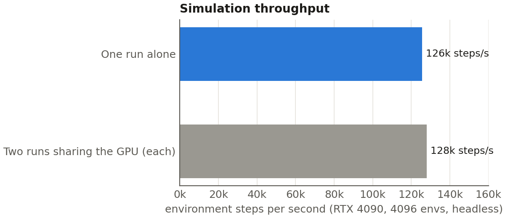

# Results

All figures below are reproducible from the per-iteration logs in
[`../data/training_logs/`](../data/training_logs). An interactive version with hover values and a
sortable table is in [report/xhand_training_report.html](report/xhand_training_report.html).

## Headline

| Metric | Value | Conditions |
|---|---|---|
| Hold success | **70 %** | Stage 4, full domain randomization, mean of last 100 iterations (4096 envs/iteration) |
| Drop rate | **9 %** | same |
| Flip success, recorded demos | **49 / 50** | fixed-wrist hand grid, green target = every episode a 180° flip, Stage 4 `model_6198` |
| Flip success, arm-mounted | **10 / 10** | Franka + XHand1, close and top cameras, Stage 4 `model_6198`, zero retraining |
| Open-loop replay in sim | **48 %** | Stage 4 exported commanded trajectory, 64 freshly randomized sponges (Run B policy: 34–38 %) |
| Throughput | 126k env-steps/s | one RTX 4090, 4096 envs, headless |

## Per-run summary

Means over each run's last 100 iterations. `hold_success` and `dropped` are fractions of completed
episodes; `r_face_alignment` is the dense shaping reward in [0, 1]; mean episode length is in control
steps at 30 Hz with a cap of 360.

| Run | Log file | Sponge pose | Init | Iterations | Hold success | Drop | Face-align | Mean ep. |
|---|---|---|---|---|---|---|---|---|
| Stage 4 | `yaw90_s4.csv` | long axis along thumb | Run B `model_4699` | 4699–6198 | **0.697** | 0.090 | 0.461 | 179 |
| Run B (warm) | `yaw90_warm_r2.csv` | long axis along thumb | Stage 2 `model_699` | 699–4699 | 0.680 | 0.078 | 0.488 | 189 |
| Run A (scratch) | `yaw90_scratch_r2.csv` | long axis along thumb | random | 0–3999 | 0.610 | 0.097 | 0.515 | 201 |
| Earlier S3→S4 chain | `stage4_chain.csv` | short axis along thumb | Stage 2 `model_699` | 699–3943 | 0.232 | 0.557 | 0.283 | 89 |
| Stage 2 | `stage2.csv` | short axis along thumb | Stage 1 `model_300` | 300–699 | 0.709 | 0.280 | 0.231 | 60 |
| Stage 1 | `stage1_run2.csv` | short axis along thumb | random | 0–316 | 0.845 | 0.152 | 0.243 | 62 |
| Stage 1, pre-fix | `stage1_run1_prefix.csv` | short axis along thumb | random | 0–226 | **0.000** | **1.000** | 0.009 | 2.6 |

`yaw90_scratch.csv` and `yaw90_warm.csv` are the first segments of Runs A and B, before both were
killed by `systemd-oomd` — Run A at iteration 1766, Run B at 2439; `*_r2.csv` are the resumed
continuations from their last checkpoints. `stage3_chain.csv`
is the earlier short-axis chain up to iteration 3198, continued by `stage4_chain.csv`.

Stage 1's 84 % looks better than Stage 4's 70 %, but the tasks are not comparable: Stage 1 spawns the
sponge within ±0.1 rad of the target with a fixed target face, so almost no episode requires a flip.

## Figures

### Stage 3 and Stage 4 learning curves


_Also available as [SVG](../assets/figures/fig1_stage3_curves.svg)._

Four series: Run B (warm start from Stage 2), Run A (from scratch), the earlier short-axis Stage 3→4
chain, and Stage 4 continued from Run B. Curves are smoothed with a 25-iteration moving average.
Hollow markers mark where both runs were killed by the memory watchdog and resumed from their last
checkpoint.

The comparison that matters is the short-axis chain (plateaus near 23 % with more than half of
episodes dropped) against the two long-axis runs (both cross 60 % within 1000 iterations, drops below
15 %). Run B starts from the Stage 2 checkpoint; Run A starts from random weights and reaches the same
level about 700 iterations sooner in wall-clock terms, because it skips Stages 1 and 2 entirely.

### Stages 1 and 2, and the drop-threshold bug


_Also available as [SVG](../assets/figures/fig2_curriculum_stage12.svg)._

The dashed grey line is the first real training attempt, where the 15 cm drop threshold fired on a
sponge resting 10 cm from the hand base — every episode ended within about three steps, 100 % drops,
mean reward −83. After raising the threshold to 25 cm, the same configuration reaches 85 % hold
success in 300 iterations.

### Simulation throughput


_Also available as [SVG](../assets/figures/fig3_throughput.svg)._

One RTX 4090, 4096 environments, headless; one iteration collects 98 304 environment steps. A single
simulator steps at ~126k env-steps/s. Two sharing the GPU get ~51k each — so running the two Stage 3
runs sequentially costs no total wall-clock time, and avoids the 32 GB RAM ceiling that killed them
when run concurrently.

## Best checkpoint

**Stage 4 `model_6198`** is the checkpoint to use for demos and for deployment: it matches Run B's
success rate while staying robust to the widest mass, friction, actuator-gain, control-delay and
initial-grasp ranges, and it is the strongest of the three on open-loop replay (48 % vs 34–38 %).

## Log format

Each CSV has one row per training iteration:

```
iteration, total, hold_success, dropped, time_out,
r_face_alignment, r_hold_bonus, r_dropped_penalty, r_hold_progress,
r_grasp_contact, r_excess_force, r_joint_limits,
mean_reward, mean_ep_len, iter_time_s, steps_per_s,
invalid_state, value_loss, surrogate_loss, action_std
```

`curves.json` holds the smoothed series and the last-100-iteration summary used to build the figures
and the tables above.
